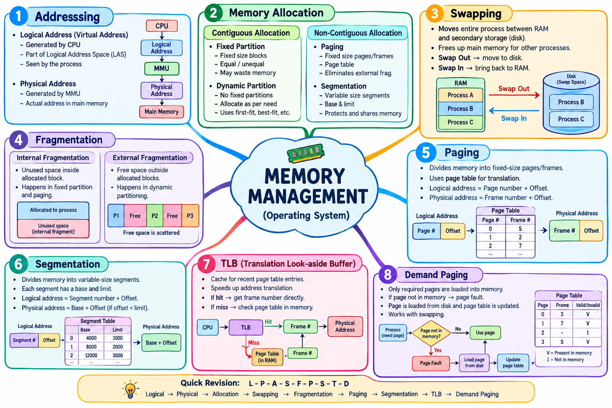

# LJ-os-sem3-chapter3-explained
---
# 📘 Operating System — Chapter 3: Memory Management

I’ll explain **the complete Chapter 3 PPT** deeply, using simple examples and diagrams, while following the terminology and topics in your PPT. The chapter covers **Memory Management, Memory Allocation, Swapping, Paging, Segmentation, TLB, and Demand Paging**.

---

# 1. 🧠 What is Memory Management?

**Memory** is a collection of data stored in a specific format. It stores:

- Program instructions
- Data being processed
- Information required by running programs

When a program is executed, it needs to be present in **main memory (RAM)** so that the CPU can access its instructions.

Your PPT states that the CPU fetches instructions from memory according to the value of the **Program Counter (PC)**.

### Simple example

Suppose you open Calculator.

```
Calculator Program
       ↓
   Loaded into RAM
       ↓
       CPU
       ↓
 Fetch instructions
       ↓
 Execute instructions
```

### Basic diagram

```
             COMPUTER
                 │
        ┌────────┴────────┐
        ↓                 ↓
       CPU               RAM
        │                 │
        │       ┌─────────┴─────────┐
        │       │ Program           │
        │       │ Instructions      │
        │       │ Data              │
        │       └───────────────────┘
        │
        └──── Fetch instructions ────→
```

**Key idea:**  
The CPU executes programs, but the instructions and required data must be available in main memory during execution.

---

# 2. 📍 Logical Address

A process can be viewed as a sequence of bytes, and **each byte has an address**.

The address generated by the CPU is called a **logical address**.

### Example

Imagine a program requires 100 bytes:

```
Logical Address Space

0    1    2    3    4    5   ...   99
│    │    │    │    │    │          │
▼    ▼    ▼    ▼    ▼    ▼          ▼
Byte Byte Byte Byte Byte Byte       Byte
```

Each byte has its own logical address.

### Logical Address Space — LAS

**Logical Address Space (LAS)** is the set of all logical addresses that a process can reference.

For example:

```
Process
  │
  ↓
Logical Address Space
┌──────────────────────────┐
│ 0  1  2  3  4 ... 999    │
└──────────────────────────┘
```

### 32-bit example

Your PPT gives the example that a **32-bit processor** can generate up to:

**2³² = 4 GB addresses**.

---

# 3. 📦 Physical Address

A **physical address** is the actual address seen by the memory unit.

The **Memory Management Unit (MMU)** generates/translates physical addresses.

Think of it like this:

```
CPU
 │
 │ Logical Address
 ▼
┌─────────────┐
│     MMU     │
│ Translation │
└──────┬──────┘
       │
       │ Physical Address
       ▼
┌─────────────────┐
│      RAM        │
│                 │
│ Actual location │
└─────────────────┘
```

### Important difference

|Logical Address|Physical Address|
|---|---|
|Generated by CPU|Used by memory|
|Process's view|Actual memory location|
|Translated by MMU|Corresponds to RAM|
|Also called virtual address in many contexts|Actual address|

### Easy analogy

Imagine a library.

```
Logical Address = "Book #25"

       ↓ Librarian/MMU

Physical Address = "Shelf 4, Row 2"
```

The program doesn't necessarily need to know the exact physical RAM location.

---

# 4. 🗂️ Memory Allocation

Your PPT divides memory allocation into two major categories:

```
                 MEMORY ALLOCATION
                        │
            ┌───────────┴───────────┐
            ↓                       ↓
     CONTIGUOUS                NON-CONTIGUOUS
       ALLOCATION                 ALLOCATION
            │                       │
       ┌────┴────┐              ┌───┴────┐
       ↓         ↓              ↓        ↓
 Fixed       Dynamic          Paging  Segmentation
 Partition   Partition
```

---

# 5. 🧱 Contiguous Memory Allocation

In contiguous allocation, a process is allocated a **continuous block of memory**.

For example:

```
RAM
┌──────────────────────┐
│ Operating System     │
├──────────────────────┤
│ Process A            │
│ Process A            │
│ Process A            │
├──────────────────────┤
│ Process B            │
│ Process B            │
├──────────────────────┤
│ Free                 │
└──────────────────────┘
```

The process occupies one continuous region.

There are two methods in your PPT:

1. Fixed Partition
2. Dynamic Partition

---

# 6. 🧱 Fixed Partition

In **fixed partitioning**, memory is divided into fixed-size partitions.

The partition sizes may be equal or unequal. Your PPT notes that unequal-sized partitions can provide better utilization.

### Example

Suppose RAM has 100 MB available.

```
RAM
┌──────────────────┐
│ OS               │
├──────────────────┤
│ Partition 1 20MB │
├──────────────────┤
│ Partition 2 30MB │
├──────────────────┤
│ Partition 3 10MB │
├──────────────────┤
│ Partition 4 40MB │
└──────────────────┘
```

Suppose:

```
Process A = 18 MB
Process B = 27 MB
Process C = 8 MB
```

They can be placed into suitable partitions.

### Problem

Suppose a 20 MB partition contains an 8 MB process.

```
Partition = 20 MB

┌────────────────────┐
│ Process = 8 MB     │
├────────────────────┤
│ UNUSED = 12 MB     │
└────────────────────┘
```

That unused space inside an allocated partition leads to **internal fragmentation**.

---

# 7. 🔄 Dynamic Partition

Dynamic partitioning does **not** divide memory into fixed-size partitions.

The process gets approximately the amount of memory it requires.

### Example

Suppose:

```
Process A = 20 MB
Process B = 35 MB
Process C = 15 MB
```

Memory can be allocated according to their requirements:

```
RAM

┌──────────────────────┐
│ Operating System     │
├──────────────────────┤
│ Process A = 20 MB   │
├──────────────────────┤
│ Process B = 35 MB   │
├──────────────────────┤
│ Process C = 15 MB   │
├──────────────────────┤
│ Free Memory          │
└──────────────────────┘
```

If a process enters, the OS searches for a sufficiently large free area.

If enough memory isn't available, the process must wait.

---

# 8. 🧩 Fragmentation

**Fragmentation** means memory is available, but some of it cannot be effectively allocated to a process.

Your PPT identifies two types:

1. **External Fragmentation**
2. **Internal Fragmentation**

---

## 8.1 Internal Fragmentation

Unused memory exists **inside an allocated partition/block**.

Example:

```
Allocated Partition = 20 MB
Process requires = 15 MB

┌────────────────────┐
│ Process = 15 MB    │
├────────────────────┤
│ Unused = 5 MB      │ ← Internal fragmentation
└────────────────────┘
```

The 5 MB is inside the allocated partition.

### Remember:

> **Internal = inside**

---

## 8.2 External Fragmentation

Free memory exists **outside allocated blocks**, but it is scattered.

Example:

```
RAM

┌────────────────────┐
│ Process A          │
├────────────────────┤
│ FREE = 5 MB        │
├────────────────────┤
│ Process B          │
├────────────────────┤
│ FREE = 7 MB        │
├────────────────────┤
│ Process C          │
├────────────────────┤
│ FREE = 8 MB        │
└────────────────────┘
```

Total free memory:

**5 + 7 + 8 = 20 MB**

But suppose a new process requires **15 MB contiguous space**.

There is no single 15 MB free block.

```
5 MB + 7 MB + 8 MB = 20 MB

BUT

No single 15 MB block ❌
```

This is **external fragmentation**.

### Remember:

> **External = outside allocated blocks**

---

# 9. 🔄 Swapping

Swapping is a memory-management technique where a process can temporarily move from **main memory to secondary memory** so that RAM becomes available for another process.

### Main idea

```
             RAM
              │
       Process A
              │
              │ SWAP OUT
              ↓
       ┌─────────────┐
       │ Disk /      │
       │ Secondary   │
       │ Memory      │
       └─────────────┘
              │
              │ SWAP IN
              ↓
             RAM
```

### Detailed diagram

```
             MAIN MEMORY
          ┌───────────────┐
          │     OS        │
          ├───────────────┤
          │  Process A    │
          ├───────────────┤
          │  Process B    │
          ├───────────────┤
          │  Process C    │
          └───────────────┘
                 │
             SWAP OUT
                 ↓
       ┌──────────────────┐
       │ Secondary Memory │
       │                  │
       │   Process B      │
       │  (Swap Space)    │
       └──────────────────┘
                 │
             SWAP IN
                 ↓
          MAIN MEMORY
```

### Example

Suppose RAM can hold:

```
OS + A + B + C
```

Now Process D needs memory.

The OS can temporarily move one process to secondary storage:

```
Before:

RAM
┌─────┐
│ OS  │
├─────┤
│ A   │
├─────┤
│ B   │
├─────┤
│ C   │
└─────┘

        ↓ Swap B out

RAM                  Disk
┌─────┐             ┌─────┐
│ OS  │             │ B   │
├─────┤             └─────┘
│ A   │
├─────┤
│ C   │
├─────┤
│ D   │
└─────┘
```

The area where the swapped-out process is stored is called **swap space**.

---

# 10. 📄 Paging

Paging is a **non-contiguous memory allocation** technique.

Your PPT describes the logical address space of a process as being divided into partitions, with corresponding chunks allocated in physical memory.

The important terms are:

- **Page**
- **Frame**
- **Page number**
- **Offset**
- **Page table**

### Basic idea

Logical memory:

```
Process
┌────────────┐
│ Page 0     │
├────────────┤
│ Page 1     │
├────────────┤
│ Page 2     │
├────────────┤
│ Page 3     │
└────────────┘
```

Physical memory:

```
RAM
┌────────────┐
│ Frame 0    │
├────────────┤
│ Frame 1    │
├────────────┤
│ Frame 2    │
├────────────┤
│ Frame 3    │
├────────────┤
│ Frame 4    │
├────────────┤
│ Frame 5    │
└────────────┘
```

Pages don't necessarily have to occupy consecutive frames.

For example:

```
Page 0 → Frame 3
Page 1 → Frame 5
Page 2 → Frame 1
Page 3 → Frame 4
```

The **page table** stores this mapping.

```
             PAGE TABLE

Page       Frame
────       ─────
  0    →     3
  1    →     5
  2    →     1
  3    →     4
```

---

# 11. 🔢 Paging Address Structure

A logical address is divided into parts.

Your PPT specifically identifies the **page number (p)** as the number of bits required to represent pages in the logical address space.

A common representation is:

```
Logical Address

┌──────────────────┬──────────────────┐
│   Page Number    │      Offset      │
│       p          │        d         │
└──────────────────┴──────────────────┘
```

### Example

Suppose:

```
Logical address = 1234
```

The system separates it into:

```
Page number + Offset
```

Then:

```
Page number
      ↓
Page Table
      ↓
Frame number
      ↓
Physical address
```

### Complete process

```
CPU
 │
 │ Logical Address
 ▼
┌──────────────────────┐
│ Page No. + Offset    │
└──────────┬───────────┘
           │
           ↓
      Page Table
           │
           ↓
      Frame Number
           │
           └────────────┐
                        ↓
              Physical Address
              ┌────────────────┐
              │ Frame + Offset │
              └───────┬────────┘
                      ↓
                     RAM
```

---

# 12. 📚 Segmentation

Segmentation is another **non-contiguous memory-management technique**.

Unlike paging, segmentation divides memory into **variable-size parts**, called **segments**.

A program can logically consist of:

```
Program
│
├── Code Segment
├── Data Segment
├── Stack Segment
└── Other Segment
```

### Example

```
Process

┌───────────────────┐
│ Code              │
│ 20 KB             │
├───────────────────┤
│ Data              │
│ 10 KB             │
├───────────────────┤
│ Stack             │
│ 15 KB             │
└───────────────────┘
```

These segments can have different sizes.

---

# 13. 📋 Segment Table

The details of each segment are stored in a **segment table**.

Your PPT identifies two main pieces of information:

### Base

The **base** is the starting physical address of the segment.

### Limit

The **limit** represents the length/size of the segment.

Example:

```
Segment Table

Segment       Base       Limit
───────       ────       ─────
  0           1000       500
  1           3000       800
  2           5000       300
```

---

# 14. 🎯 Segmentation Address

The CPU generates a logical address containing:

1. **Segment number**
2. **Offset**

Your PPT explicitly defines this structure.

```
Logical Address

┌──────────────────┬──────────────────┐
│ Segment Number   │      Offset      │
└──────────────────┴──────────────────┘
```

### Example

Suppose:

```
Segment number = 1
Offset = 200
```

Segment table:

```
Segment 1
Base  = 3000
Limit = 800
```

Since:

```
Offset 200 < Limit 800
```

the address is valid.

Physical address:

```
Base + Offset

= 3000 + 200

= 3200
```

So:

```
Logical Address
       │
       ↓
Segment = 1
Offset  = 200
       │
       ↓
Segment Table
       │
       ↓
Base = 3000
       │
       ↓
3000 + 200
       │
       ↓
Physical Address = 3200
```

---

# 15. ⚡ TLB — Translation Look-Aside Buffer

**TLB** is a memory cache used to reduce the time required to access a memory location.

Your PPT describes it as part of the MMU that stores recent virtual-to-physical address translations.

### Why do we need TLB?

Without TLB:

```
CPU
 ↓
Page Table
 ↓
RAM
```

The CPU may repeatedly need to access the page table.

TLB keeps frequently used translations nearby.

```
             CPU
              │
              ↓
             TLB
          ┌─────────┐
          │ Recent  │
          │ mappings│
          └────┬────┘
               │
        ┌──────┴──────┐
        ↓             ↓
      Found         Not Found
     (Hit)          (Miss)
        │             │
        ↓             ↓
       RAM         Page Table
                      │
                      ↓
                     RAM
```

### Example

Suppose the CPU frequently requests:

```
Page 5 → Frame 12
```

The TLB remembers this translation.

Next time:

```
CPU
 ↓
TLB
 ↓
Page 5 → Frame 12
 ↓
RAM
```

This avoids repeatedly searching the page table.

---

# 16. 🚨 Demand Paging

Demand paging is similar to **paging combined with swapping**.

Instead of loading the entire process into memory, only the pages required for execution are brought into memory.

### Normal swapping

```
Entire Process
      ↓
    RAM
```

### Demand paging

```
Entire Process
      │
      ↓
 Secondary Storage
      │
      ├── Page 0
      ├── Page 1
      ├── Page 2
      ├── Page 3
      ├── Page 4
      └── Page 5
             │
             ↓
     Only required pages
             ↓
            RAM
```

---

# 17. ✅ Valid–Invalid Bit

Demand paging uses a **valid-invalid bit** in the page table.

Your PPT explains:

- **Valid** → page is currently in memory.
- **Invalid** → page is not currently loaded in memory.

Example:

```
Page Table

Page       Frame       Bit
────       ─────       ───
 0           4          V
 1           7          V
 2           -          I
 3           2          V
 4           -          I
```

Meaning:

```
Page 0 → RAM ✅
Page 1 → RAM ✅
Page 2 → Disk ❌
Page 3 → RAM ✅
Page 4 → Disk ❌
```

---

# 18. 🔥 Complete Demand Paging Flow

Suppose the CPU wants **Page 4**.

```
                 CPU
                  │
                  ↓
             Request Page 4
                  │
                  ↓
             Page Table
                  │
             ┌────┴────┐
             ↓         ↓
          Valid       Invalid
             │           │
             ↓           ↓
            RAM       Page Fault
                         │
                         ↓
                   Find Page 4
                    on Disk
                         │
                         ↓
                    Load Page
                         │
                         ↓
                       RAM
                         │
                         ↓
                 Update Page Table
                         │
                         ↓
                    Continue
                    Execution
```

### Example

Suppose a program has:

```
Page 0
Page 1
Page 2
Page 3
Page 4
```

Only these are currently in RAM:

```
RAM:
Page 0
Page 1
Page 3
```

Then the CPU requests Page 4.

```
Page 4
  │
  ↓
Valid bit?
  │
  ↓
INVALID
  │
  ↓
Page must be brought
from secondary storage
  │
  ↓
RAM
  │
  ↓
Valid bit = VALID
```

The PPT states that when a page is loaded, its corresponding frame number is entered and its validity bit is set to valid.

---

# 🧠 Complete Chapter Mind Map

```
                    MEMORY MANAGEMENT
                           │
        ┌──────────────────┼──────────────────┐
        │                  │                  │
        ↓                  ↓                  ↓
     ADDRESS          ALLOCATION           SWAPPING
        │                  │                  │
   ┌────┴────┐       ┌─────┴─────┐           │
   ↓         ↓       ↓           ↓           ↓
Logical   Physical  Contiguous  Non-      RAM ↔ Disk
Address   Address   Allocation  Contiguous
                         │       Allocation
                    ┌────┴───┐       │
                    ↓        ↓    ┌──┴────────┐
                  Fixed    Dynamic │           │
                Partition Partition Paging  Segmentation
                    │
                    ↓
              Fragmentation
                 ┌──┴───┐
                 ↓      ↓
              Internal External

                    PAGING
                       │
             ┌─────────┴─────────┐
             ↓                   ↓
          Page Table          TLB
             │
             ↓
        Page → Frame

                 DEMAND PAGING
                       │
                       ↓
                 Valid/Invalid
                       │
                 ┌─────┴─────┐
                 ↓           ↓
               Valid       Invalid
                 │           │
                 ↓           ↓
                RAM      Page Fault
                             │
                             ↓
                       Load from Disk
```

---

# ⭐ Most Important Differences

|Topic|Main Idea|
|---|---|
|**Logical Address**|Address generated by CPU|
|**Physical Address**|Actual memory address|
|**MMU**|Handles address translation|
|**Fixed Partition**|Memory divided into fixed partitions|
|**Dynamic Partition**|Memory allocated according to process requirement|
|**Internal Fragmentation**|Unused space inside allocated block|
|**External Fragmentation**|Free space scattered outside allocated blocks|
|**Swapping**|Move process between RAM and secondary storage|
|**Paging**|Divide address space into pages and map them to frames|
|**Segmentation**|Divide process into variable-size segments|
|**TLB**|Cache for recent address translations|
|**Demand Paging**|Load only required pages into RAM|
|**Valid Bit**|Indicates page is present|
|**Invalid Bit**|Indicates page is not currently in memory|

### 🔑 One-line memory trick

```
Logical → MMU → Physical
Fixed/Dynamic → Contiguous
Paging/Segmentation → Non-contiguous
RAM ↔ Disk → Swapping
Page → Frame → Paging
Segment → Base + Limit → Segmentation
Recent translation → TLB
Required page only → Demand Paging
```

This covers the concepts presented in your **Chapter 3 — Memory Management** PPT, including all the listed sections through Demand Paging.

# 🧠 Operating System — Chapter 3 Mind Map

## **MEMORY MANAGEMENT**

Based directly on your Chapter 3 PPT.

```text
                         ┌──────────────────────────────┐
                         │      MEMORY MANAGEMENT       │
                         └──────────────┬───────────────┘
                                        │
        ┌───────────────────────────────┼───────────────────────────────┐
        │                               │                               │
        ▼                               ▼                               ▼
 ┌───────────────┐              ┌────────────────┐              ┌──────────────┐
 │   ADDRESSING  │              │ MEMORY         │              │  SWAPPING    │
 └───────┬───────┘              │ ALLOCATION     │              └──────┬───────┘
         │                       └───────┬────────┘                     │
    ┌────┴─────┐                         │                              │
    ▼          ▼                  ┌──────┴──────┐                       │
 Logical    Physical              │             │                       │
 Address    Address               ▼             ▼                       ▼
    │          │            CONTIGUOUS     NON-CONTIGUOUS          RAM ↔ DISK
    │          │              ALLOCATION     ALLOCATION                │
    │          │                  │             │                      │
    │          │             ┌────┴────┐    ┌───┴────────┐             │
    │          │             ▼         ▼    ▼            ▼             │
    │          │           FIXED    DYNAMIC PAGING   SEGMENTATION      │
    │          │         PARTITION PARTITION                           │
    │          │             │         │                                │
    │          │             │         │                                │
    │          │             └────┬────┘                                │
    │          │                  │                                     │
    │          │                  ▼                                     │
    │          │            FRAGMENTATION                               │
    │          │             ┌────┴────┐                                │
    │          │             ▼         ▼                                │
    │          │          INTERNAL  EXTERNAL                            │
    │          │          FRAGMENT.  FRAGMENT.                          │
    │          │                                                          │
    └──────────┴──────────────────────────────────────────────────────────┘
```

---

# 🔹 Detailed Mind Map

```text
                         MEMORY MANAGEMENT
                                │
       ┌────────────────────────┼────────────────────────┐
       │                        │                        │
       ▼                        ▼                        ▼
  LOGICAL ADDRESS         PHYSICAL ADDRESS          ALLOCATION
       │                        │                        │
       │                        │               ┌────────┴────────┐
       │                        │               │                 │
       ▼                        ▼               ▼                 ▼
 Generated by CPU       Generated by MMU   CONTIGUOUS      NON-CONTIGUOUS
       │                                        │                 │
       ▼                                  ┌─────┴─────┐      ┌────┴─────┐
 Logical Address                         │           │      │          │
 Space                                  FIXED      DYNAMIC PAGING SEGMENTATION
 (LAS)                                  PARTITION   PARTITION
       │
       ▼
 Set of all logical
 addresses referenced
 by a process
```

---

# 🔹 Fixed & Dynamic Partition

```text
                 MEMORY ALLOCATION
                         │
             ┌───────────┴───────────┐
             ▼                       ▼
       FIXED PARTITION          DYNAMIC PARTITION
             │                       │
             ▼                       ▼
       Fixed-size blocks       No fixed partitions
             │                       │
             ▼                       ▼
       Multiple processes      Allocate according
       can execute             to process size
             │                       │
             ▼                       ▼
       Equal / unequal         Find sufficiently
       partitions              large free space
```

### Example

```text
FIXED PARTITION

┌──────────────┐
│     OS       │
├──────────────┤
│ Partition 1  │
├──────────────┤
│ Partition 2  │
├──────────────┤
│ Partition 3  │
├──────────────┤
│ Partition 4  │
└──────────────┘


DYNAMIC PARTITION

┌──────────────┐
│     OS       │
├──────────────┤
│ Process A    │ ← allocated as required
├──────────────┤
│ Process B    │
├──────────────┤
│ Process C    │
├──────────────┤
│ Free Space   │
└──────────────┘
```

---

# 🔹 Fragmentation

```text
                    FRAGMENTATION
                          │
              ┌───────────┴───────────┐
              ▼                       ▼
        INTERNAL                  EXTERNAL
       FRAGMENTATION             FRAGMENTATION
              │                       │
              ▼                       ▼
      Unused space INSIDE       Free space OUTSIDE
      allocated block           allocated blocks
              │                       │
              ▼                       ▼
      ┌──────────────┐          ┌──────────────┐
      │ Process      │          │ Process      │
      ├──────────────┤          ├──────────────┤
      │ UNUSED       │          │ FREE         │
      └──────────────┘          ├──────────────┤
                                │ Process      │
                                ├──────────────┤
                                │ FREE         │
                                └──────────────┘
```

---

# 🔹 Swapping

```text
                         SWAPPING
                            │
                            ▼
                    ┌───────────────┐
                    │ Main Memory   │
                    │     RAM       │
                    └───────┬───────┘
                            │
                       SWAP OUT
                            ▼
                    ┌───────────────┐
                    │ Secondary     │
                    │ Memory / Disk │
                    │               │
                    │  Swap Space   │
                    └───────┬───────┘
                            │
                        SWAP IN
                            ▼
                    ┌───────────────┐
                    │ Main Memory   │
                    │     RAM       │
                    └───────────────┘
```

---

# 🔹 Paging

```text
                           PAGING
                              │
                 ┌────────────┴────────────┐
                 ▼                         ▼
             LOGICAL                   PHYSICAL
             MEMORY                     MEMORY
                 │                         │
                 ▼                         ▼
               PAGES                    FRAMES
                 │                         │
                 └──────────┬──────────────┘
                            ▼
                       PAGE TABLE
                            │
                            ▼
                      Page → Frame
                            │
                            ▼
                    Physical Address
```

### Address

```text
       LOGICAL ADDRESS
       ┌───────────────┐
       │ Page │ Offset │
       └───┬───────────┘
           │
           ▼
       PAGE TABLE
           │
           ▼
       FRAME NUMBER
           │
           ▼
    PHYSICAL ADDRESS
       ┌───────────────┐
       │ Frame │Offset │
       └───────────────┘
```

---

# 🔹 Segmentation

```text
                       SEGMENTATION
                             │
                             ▼
                    Variable-size parts
                             │
              ┌──────────────┼──────────────┐
              ▼              ▼              ▼
            CODE           DATA           STACK
              │              │              │
              └──────────────┼──────────────┘
                             ▼
                       SEGMENT TABLE
                             │
                    ┌────────┴────────┐
                    ▼                 ▼
                  BASE              LIMIT
                    │                 │
                    └────────┬────────┘
                             ▼
                       Physical Address
```

### Address

```text
       LOGICAL ADDRESS
       ┌─────────────────┐
       │ Segment │ Offset│
       └────┬────────────┘
            │
            ▼
       SEGMENT TABLE
            │
       ┌────┴────┐
       ▼         ▼
     BASE      LIMIT
       │
       ▼
 BASE + OFFSET
       │
       ▼
 PHYSICAL ADDRESS
```

---

# 🔹 TLB

```text
                         TLB
                Translation Look-aside
                       Buffer
                         │
                         ▼
                    CPU Request
                         │
                         ▼
                    ┌─────────┐
                    │   TLB   │
                    └────┬────┘
                         │
                  ┌──────┴──────┐
                  ▼             ▼
                 HIT           MISS
                  │             │
                  ▼             ▼
             Get Frame      Page Table
                  │             │
                  └──────┬──────┘
                         ▼
                        RAM
```

**TLB = cache containing recent address translations.**

---

# 🔹 Demand Paging

```text
                       DEMAND PAGING
                             │
                             ▼
                    Process on Disk
                             │
                             ▼
                 Only required page
                             │
                             ▼
                           RAM
                             │
                  ┌──────────┴──────────┐
                  ▼                     ▼
               VALID                 INVALID
                  │                     │
                  ▼                     ▼
             Page in RAM           Page not in RAM
                                        │
                                        ▼
                                  PAGE FAULT
                                        │
                                        ▼
                                  Load from Disk
                                        │
                                        ▼
                                       RAM
                                        │
                                        ▼
                                Update Page Table
                                        │
                                        ▼
                                    Continue
```

### Valid/Invalid Bit

```text
PAGE TABLE

┌──────┬────────┬─────────────┐
│ Page │ Frame  │ Valid/Invalid│
├──────┼────────┼─────────────┤
│  0   │   3    │     V       │
│  1   │   7    │     V       │
│  2   │   -    │     I       │
│  3   │   5    │     V       │
└──────┴────────┴─────────────┘

V = Page present in memory
I = Page not currently in memory
```

Your PPT specifically describes demand paging as paging with swapping where only required pages are brought into memory.

---

# 🧠 FINAL ONE-PAGE REVISION MAP

```text
                    ⭐ MEMORY MANAGEMENT ⭐
                             │
 ┌───────────────────────────┼───────────────────────────┐
 │                           │                           │
 ▼                           ▼                           ▼
ADDRESS                   ALLOCATION                  SWAPPING
 │                           │                           │
 ├─ Logical                  ├─ Contiguous              ├─ Swap Out
 │  └─ LAS                   │   ├─ Fixed               ├─ Swap Space
 │                           │   └─ Dynamic             └─ Swap In
 └─ Physical                 │
    └─ MMU                   └─ Non-Contiguous
                                ├─ Paging
                                │   ├─ Page
                                │   ├─ Frame
                                │   └─ Page Table
                                │
                                └─ Segmentation
                                    ├─ Segment
                                    ├─ Base
                                    └─ Limit

                             │
                             ▼
                      FRAGMENTATION
                       ├─ Internal
                       └─ External

                             │
                             ▼
                            TLB
                             │
                       Address Cache

                             │
                             ▼
                      DEMAND PAGING
                             │
                    ┌────────┴────────┐
                    ▼                 ▼
                  VALID            INVALID
                    │                 │
                  RAM             PAGE FAULT
                                      │
                                      ▼
                                Disk → RAM
```

### 🎯 Exam memory trick

**“L-P-A-S-F-P-S-T-D”**

> **L**ogical → **P**hysical → **A**llocation → **S**wapping → **F**ragmentation → **P**aging → **S**egmentation → **T**LB → **D**emand Paging.

<p align="center">
  
</p>
## 50 MCQs with Answers

Based on your uploaded Chapter 3 PPT and its topics.

### 1. Memory is mainly used to store:

A) Only programs  
B) Only data  
C) Instructions and processed data  
D) Only files

**Answer: C**

---

### 2. Who generates the logical address?

A) RAM  
B) CPU  
C) Hard disk  
D) TLB

**Answer: B**

---

### 3. Logical Address Space is abbreviated as:

A) PAS  
B) LAS  
C) MAS  
D) CPU

**Answer: B**

---

### 4. LAS represents:

A) All physical addresses  
B) All logical addresses referenced by a process  
C) Only RAM addresses  
D) Only disk addresses

**Answer: B**

---

### 5. A 32-bit processor can generate up to:

A) 1 GB  
B) 2 GB  
C) 4 GB  
D) 8 GB

**Answer: C**

The PPT gives **2³² = 4 GB** as the example.

---

### 6. The address seen by the memory unit is called:

A) Logical address  
B) Physical address  
C) Virtual instruction  
D) Segment address

**Answer: B**

---

### 7. Physical addresses are associated with:

A) CPU only  
B) Memory unit  
C) Keyboard  
D) Compiler

**Answer: B**

---

### 8. Which component handles memory address translation?

A) ALU  
B) MMU  
C) CPU register  
D) Compiler

**Answer: B**

---

### 9. Memory allocation is broadly divided into:

A) Paging and TLB  
B) Fixed and dynamic only  
C) Contiguous and non-contiguous  
D) RAM and ROM

**Answer: C**

---

### 10. Which is a contiguous allocation technique?

A) Paging  
B) Segmentation  
C) Fixed partition  
D) TLB

**Answer: C**

---

### 11. Which is a non-contiguous allocation technique?

A) Fixed partition  
B) Dynamic partition  
C) Paging  
D) None

**Answer: C**

---

### 12. In fixed partitioning, memory is divided into:

A) Random blocks  
B) Fixed-size partitions  
C) Pages only  
D) Segments only

**Answer: B**

---

### 13. Fixed partitions can be:

A) Only equal  
B) Only unequal  
C) Equal or unequal  
D) Always dynamic

**Answer: C**

---

### 14. Unequal-sized partitions are generally used for:

A) Increasing disk space  
B) Better memory utilization  
C) Increasing CPU speed  
D) Reducing RAM size

**Answer: B**

---

### 15. Fixed partitioning allows:

A) Only one process  
B) Multiple processes to execute simultaneously  
C) No processes  
D) Only system processes

**Answer: B**

---

### 16. In dynamic partitioning, memory is:

A) Always divided into equal partitions  
B) Divided into fixed partitions  
C) Allocated according to process requirements  
D) Never allocated

**Answer: C**

---

### 17. In dynamic partitioning, the number of partitions is:

A) Fixed  
B) Not fixed  
C) Always two  
D) Always four

**Answer: B**

---

### 18. If enough free memory is unavailable in dynamic partitioning, the process:

A) Executes immediately  
B) Is deleted  
C) Waits  
D) Becomes the OS

**Answer: C**

---

### 19. Fragmentation refers to:

A) Increased CPU speed  
B) Unused memory that cannot be allocated effectively  
C) Increased disk capacity  
D) Faster paging

**Answer: B**

---

### 20. How many major types of fragmentation are mentioned in the PPT?

A) One  
B) Two  
C) Three  
D) Four

**Answer: B**

---

### 21. The two types of fragmentation are:

A) Page and frame  
B) Internal and external  
C) Logical and physical  
D) Base and limit

**Answer: B**

---

### 22. Internal fragmentation means:

A) Free space outside allocated memory  
B) Unused space inside an allocated block  
C) Memory on disk  
D) Invalid pages

**Answer: B**

---

### 23. External fragmentation means:

A) Unused space scattered outside allocated blocks  
B) Unused space inside a partition  
C) CPU cache  
D) TLB storage

**Answer: A**

---

### 24. Which fragmentation occurs inside an allocated block?

A) External  
B) Internal  
C) Logical  
D) Physical

**Answer: B**

---

### 25. Which fragmentation occurs due to scattered free memory?

A) Internal  
B) External  
C) Paging  
D) Segmentation

**Answer: B**

---

### 26. Swapping involves moving processes between:

A) CPU and cache  
B) RAM and secondary memory  
C) Keyboard and CPU  
D) ROM and CPU

**Answer: B**

---

### 27. The area used to store a swapped-out process is called:

A) Page table  
B) Swap space  
C) Segment table  
D) TLB

**Answer: B**

---

### 28. The main purpose of swapping is to:

A) Increase keyboard speed  
B) Improve main-memory utilization  
C) Increase CPU size  
D) Remove the OS

**Answer: B**

---

### 29. Swapping can affect:

A) System performance  
B) Keyboard layout  
C) Monitor resolution  
D) File names

**Answer: A**

---

### 30. Paging is a:

A) Contiguous allocation technique  
B) Non-contiguous allocation technique  
C) CPU scheduling technique  
D) File-management technique

**Answer: B**

---

### 31. In paging, logical memory is divided into:

A) Frames  
B) Pages  
C) Segments  
D) Partitions only

**Answer: B**

---

### 32. Physical memory is divided into:

A) Pages  
B) Frames  
C) Segments  
D) Processes

**Answer: B**

---

### 33. The mapping between pages and frames is maintained by:

A) Segment table  
B) Page table  
C) CPU  
D) Swap table

**Answer: B**

---

### 34. A logical address in paging contains:

A) Segment and offset  
B) Page number and offset  
C) Base and limit  
D) Frame and segment

**Answer: B**

---

### 35. The page number identifies:

A) A page in logical address space  
B) A CPU  
C) A disk  
D) A process ID only

**Answer: A**

---

### 36. Segmentation divides memory into:

A) Equal fixed-size pages  
B) Variable-size parts  
C) Only frames  
D) Only fixed partitions

**Answer: B**

---

### 37. Each variable-size part in segmentation is called a:

A) Page  
B) Frame  
C) Segment  
D) Block

**Answer: C**

---

### 38. Segment information is stored in:

A) Page table  
B) Segment table  
C) TLB only  
D) CPU

**Answer: B**

---

### 39. The segment table mainly contains:

A) Page and frame  
B) Base and limit  
C) CPU and RAM  
D) Page and offset

**Answer: B**

---

### 40. Base represents:

A) Length of segment  
B) Starting address of segment  
C) Page number  
D) TLB size

**Answer: B**

---

### 41. Limit represents:

A) Starting address  
B) Length of the segment  
C) Frame number  
D) CPU speed

**Answer: B**

---

### 42. A segmentation logical address contains:

A) Page number and offset  
B) Segment number and offset  
C) Base and frame  
D) Frame and page

**Answer: B**

---

### 43. TLB stands for:

A) Translation Logical Buffer  
B) Translation Look-Aside Buffer  
C) Temporary Logical Block  
D) Transfer Look Buffer

**Answer: B**

---

### 44. TLB is a:

A) Memory cache  
B) Hard disk  
C) CPU scheduler  
D) Process

**Answer: A**

---

### 45. TLB stores:

A) Recent address translations  
B) Entire programs  
C) Only files  
D) Operating-system source code

**Answer: A**

---

### 46. TLB is used to:

A) Increase disk capacity  
B) Reduce memory-access time  
C) Create processes  
D) Allocate CPU time

**Answer: B**

---

### 47. Demand paging loads:

A) The entire process at once  
B) Only required pages  
C) Only the OS  
D) Only segments

**Answer: B**

---

### 48. In demand paging, a valid bit means:

A) Page is currently in memory  
B) Page has been deleted  
C) Page is always on disk  
D) Page is corrupted

**Answer: A**

---

### 49. In demand paging, an invalid bit means:

A) Page is currently in memory  
B) Page is not currently loaded in memory  
C) Page is always valid  
D) Page belongs to the OS

**Answer: B**

---

### 50. When a page is loaded into memory in demand paging, its:

A) Frame number is entered and validity bit becomes valid  
B) Segment number is deleted  
C) CPU is stopped permanently  
D) TLB is destroyed

**Answer: A**

## 50 One-Marker Questions with Answers

Based strictly on the **Operating System – Chapter 3 PPT**.

### 🔹 Memory & Addressing

**Q1. What is memory in an operating system?**  
**Ans:** Memory stores instructions and processed data.

**Q2. Where should programs be placed for execution?**  
**Ans:** In main memory.

**Q3. What does the CPU fetch from memory?**  
**Ans:** Instructions according to the program counter.

**Q4. What is a logical address?**  
**Ans:** An address generated by the CPU.

**Q5. What is a process address space?**  
**Ans:** The logical address space associated with a process.

**Q6. What does LAS stand for?**  
**Ans:** Logical Address Space.

**Q7. Where does the logical address space start?**  
**Ans:** From address zero.

**Q8. How many addresses can a 32-bit processor generate?**  
**Ans:** 2322^{32} addresses.

**Q9. What is the address capacity of a 32-bit processor mentioned in the PPT?**  
**Ans:** 4 GB.

**Q10. What is a physical address?**  
**Ans:** The address seen by the memory unit.

**Q11. Which unit generates physical addresses?**  
**Ans:** The Memory Management Unit (MMU).

**Q12. What does MMU stand for?**  
**Ans:** Memory Management Unit.

---

### 🔹 Memory Allocation

**Q13. What is memory allocation?**  
**Ans:** The process of assigning memory to processes.

**Q14. What are the two broad types of memory allocation?**  
**Ans:** Contiguous and non-contiguous allocation.

**Q15. What is contiguous memory allocation?**  
**Ans:** Allocating a process in a continuous block of memory.

**Q16. What is non-contiguous memory allocation?**  
**Ans:** Allocating a process in different locations of memory.

**Q17. Name the fixed partition allocation method.**  
**Ans:** Fixed partitioning.

**Q18. What is fixed partitioning?**  
**Ans:** Dividing memory into fixed-size partitions.

**Q19. Who determines the partition sizes in fixed partitioning according to the PPT?**  
**Ans:** The manufacturer.

**Q20. Can fixed partitions have equal sizes?**  
**Ans:** Yes.

**Q21. Can fixed partitions have unequal sizes?**  
**Ans:** Yes.

**Q22. Why can unequal partitions improve memory utilization?**  
**Ans:** They can better accommodate processes of different sizes.

**Q23. What are the two input-queue approaches mentioned for fixed partitioning?**  
**Ans:** Multiple input queues and a single input queue.

**Q24. What is dynamic partitioning?**  
**Ans:** A method where partitions are created according to process requirements.

**Q25. Are the partition sizes fixed in dynamic partitioning?**  
**Ans:** No.

**Q26. Is the number of partitions fixed in dynamic partitioning?**  
**Ans:** No.

**Q27. How much memory does a process receive in dynamic partitioning?**  
**Ans:** Approximately the amount of memory it requires.

**Q28. What happens if no sufficiently large free memory area exists?**  
**Ans:** The process waits.

---

### 🔹 Fragmentation

**Q29. What is fragmentation?**  
**Ans:** Unused memory that cannot be allocated effectively.

**Q30. How many types of fragmentation are mentioned?**  
**Ans:** Two.

**Q31. Name the two types of fragmentation.**  
**Ans:** Internal fragmentation and external fragmentation.

**Q32. What is internal fragmentation?**  
**Ans:** Unused memory within an allocated partition.

**Q33. What is external fragmentation?**  
**Ans:** Unused memory existing outside allocated partitions.

**Q34. Where does internal fragmentation occur?**  
**Ans:** Inside an allocated memory block.

**Q35. Where does external fragmentation occur?**  
**Ans:** In free spaces between allocated memory blocks.

---

### 🔹 Swapping

**Q36. What is swapping?**  
**Ans:** Temporarily moving a process from main memory to secondary memory.

**Q37. Where is a swapped-out process stored?**  
**Ans:** In secondary memory.

**Q38. What is swap space?**  
**Ans:** Space in secondary storage used for swapped processes.

**Q39. Why is swapping used?**  
**Ans:** To improve memory utilization.

**Q40. What is one disadvantage of swapping?**  
**Ans:** It can affect system performance.

---

### 🔹 Paging & Segmentation

**Q41. What is paging?**  
**Ans:** A memory-management technique that divides the logical address space into partitions called pages.

**Q42. What is a page?**  
**Ans:** A partition of the logical address space in paging.

**Q43. What two parts form a CPU address in paging?**  
**Ans:** Page number and offset.

**Q44. What is segmentation?**  
**Ans:** A memory-management technique that divides memory into variable-size segments.

**Q45. What is a segment?**  
**Ans:** A variable-size part of a process's logical address space.

**Q46. What stores information about segments?**  
**Ans:** The segment table.

**Q47. What does the base field contain in a segment table?**  
**Ans:** The base address of the segment.

**Q48. What does the limit field represent?**  
**Ans:** The length of the segment.

**Q49. What are the two components of a segmentation logical address?**  
**Ans:** Segment number and offset.

---

### 🔹 TLB & Demand Paging

**Q50. What does TLB stand for?**  
**Ans:** Translation Look-Aside Buffer.

# 🟡 Chapter 3 — Memory Management

## 30 Two-Marker Questions with Answers

Based strictly on the Chapter 3 PPT topics: **Memory Management, Memory Allocation, Swapping, Paging, Segmentation, TLB, and Demand Paging.**

---

### Q1. What is memory management? Why is it needed?

**Answer:**  
Memory management is the process of managing main memory and allocating it to processes. It is needed so that programs and the data they access can be kept in main memory for CPU execution.

---

### Q2. Differentiate between logical address and physical address.

**Answer:**

|Logical Address|Physical Address|
|---|---|
|Generated by the CPU|Address seen by the memory unit|
|Belongs to the process address space|Represents the actual memory location|
|Used before address translation|Generated through the MMU|

---

### Q3. What is Logical Address Space (LAS)?

**Answer:**  
Logical Address Space is the range of logical addresses that a process can generate. It starts from address **0**.

---

### Q4. Explain the 32-bit processor address-space example.

**Answer:**  
A 32-bit processor can generate:

2322^{32}

different addresses.

This gives an address space of:

232 bytes=4 GB2^{32}\text{ bytes}=4\text{ GB}

So, a 32-bit processor can address **4 GB** of memory.

---

### Q5. What is the role of the MMU?

**Answer:**  
The **Memory Management Unit (MMU)** handles address translation and generates the physical address that is seen by the memory unit.

**Flow:**

```
CPU
 │
 │ Logical Address
 ▼
MMU
 │
 │ Physical Address
 ▼
Main Memory
```

---

### Q6. What are the two major types of memory allocation?

**Answer:**  
The two major types are:

1. **Contiguous memory allocation**
2. **Non-contiguous memory allocation**

---

### Q7. Explain contiguous memory allocation.

**Answer:**  
In contiguous allocation, a process is allocated a **continuous block of memory**.

```
Memory
┌──────────────┐
│   Process P  │
│   Continuous │
│     Block    │
└──────────────┘
```

---

### Q8. Explain non-contiguous memory allocation.

**Answer:**  
In non-contiguous allocation, different parts of a process can be placed at **different locations in memory** rather than in one continuous block.

---

### Q9. What is fixed partition memory allocation?

**Answer:**  
Fixed partitioning divides memory into a number of **fixed-size partitions**. Processes are then allocated to these partitions.

The partitions may be **equal or unequal in size**.

---

### Q10. Why are unequal fixed partitions useful?

**Answer:**  
Unequal partitions can improve memory utilization because processes with different memory requirements can be placed into more suitable partitions.

---

### Q11. What are the two input-queue approaches in fixed partitioning?

**Answer:**

1. **Multiple input queues**
2. **Single input queue**

These approaches determine how processes waiting for memory are organized.

---

### Q12. What is dynamic partitioning?

**Answer:**  
Dynamic partitioning creates memory partitions according to the requirements of processes.

Unlike fixed partitioning:

- Partition size is not fixed.
- Number of partitions is not fixed.
- Memory is allocated according to process requirements.

---

### Q13. What happens when sufficient memory is unavailable in dynamic partitioning?

**Answer:**  
If a sufficiently large free memory area is not available, the process must **wait** until suitable memory becomes available.

---

### Q14. What is fragmentation?

**Answer:**  
Fragmentation refers to **unused memory that cannot be allocated effectively**.

There are two types:

- Internal fragmentation
- External fragmentation

---

### Q15. Differentiate between internal and external fragmentation.

**Answer:**

| Internal Fragmentation                         | External Fragmentation                        |
| ---------------------------------------------- | --------------------------------------------- |
| Unused memory occurs inside an allocated block | Unused memory occurs outside allocated blocks |
| Space is wasted within an allocation           | Free spaces are separated between allocations |

---

### Q16. What is swapping?

**Answer:**  
Swapping is the process of temporarily moving a process from **main memory to secondary memory** and bringing it back when required.

```
Main Memory
    │
    │ Swap Out
    ▼
Secondary Memory
    │
    │ Swap In
    ▼
Main Memory
```

---

### Q17. What is swap space?

**Answer:**  
Swap space is the space in **secondary memory** used to temporarily store processes that have been swapped out of main memory.

---

### Q18. How does swapping improve memory utilization?

**Answer:**  
Swapping frees main-memory space by temporarily moving processes to secondary memory. This allows memory to accommodate other processes.

---

### Q19. What is one disadvantage of swapping?

**Answer:**  
Swapping can affect system performance because moving processes between main memory and secondary memory requires additional operations.

---

### Q20. What is paging?

**Answer:**  
Paging is a memory-management technique in which the **logical address space is divided into pages** and memory is organized so that pages can be placed into available physical memory.

---

### Q21. What are the two parts of a CPU address in paging?

**Answer:**

A CPU address is divided into:

1. **Page number**
2. **Offset**

```
CPU Address
┌──────────────┬──────────────┐
│  Page Number │    Offset    │
└──────────────┴──────────────┘
```

---

### Q22. What is a page number?

**Answer:**  
The page number identifies the **page** within the logical address space.

---

### Q23. What is an offset in paging?

**Answer:**  
The offset identifies the specific location within the selected page.

---

### Q24. What is segmentation?

**Answer:**  
Segmentation divides a process's logical address space into **variable-size parts called segments**.

---

### Q25. What is a segment table?

**Answer:**  
A segment table stores information about the segments, including their **base address and limit**.

---

### Q26. What are base and limit in segmentation?

**Answer:**

- **Base:** Starting/base address of the segment.
- **Limit:** Length or size of the segment.

---

### Q27. What are the components of a logical address in segmentation?

**Answer:**  
A logical address consists of:

1. **Segment number**
2. **Offset**

```
Logical Address
┌────────────────┬──────────────┐
│ Segment Number │    Offset    │
└────────────────┴──────────────┘
```

---

### Q28. What is TLB?

**Answer:**  
**TLB (Translation Look-Aside Buffer)** is a memory cache that is part of the **MMU**. It stores recent virtual-to-physical address translations.

---

### Q29. How does TLB improve memory access?

**Answer:**  
TLB reduces the time required to access the page table by keeping recently used address translations close to the CPU.

```
CPU
 │
 ▼
TLB ──► Translation found
 │
 └──► If not found → Page Table
```

---

### Q30. What is demand paging?

**Answer:**  
Demand paging is a technique in which only the **pages required by a process are loaded into main memory**. Other pages remain in secondary storage until they are needed.

The page table uses a **valid-invalid bit** to indicate whether a page is currently loaded.

# 🟠 Chapter 3 — Memory Management

## 25 Three-Marker Questions with Answers

Based on the **Chapter 3 PPT: Memory Management, Memory Allocation, Swapping, Paging, Segmentation, TLB, and Demand Paging**.

---

### Q1. Explain logical address and logical address space.

**Answer:**

A **logical address** is an address generated by the CPU during program execution.

The collection/range of logical addresses generated by a process is called its **Logical Address Space (LAS)**.

Key points:

- Generated by the CPU.
- Belongs to the process's address space.
- LAS starts from address **0**.

```
CPU
 │
 │ Logical Address
 ▼
Logical Address Space
```

---

### Q2. Explain physical address and its generation.

**Answer:**

A **physical address** is the address seen by the memory unit.

The **Memory Management Unit (MMU)** is responsible for generating the physical address from the logical address.

```
CPU
 │
 │ Logical Address
 ▼
┌─────────┐
│   MMU   │
└─────────┘
 │
 │ Physical Address
 ▼
Main Memory
```

---

### Q3. Explain the difference between logical and physical addresses.

**Answer:**

|Logical Address|Physical Address|
|---|---|
|Generated by CPU|Seen by memory unit|
|Associated with process address space|Represents memory location|
|Used before translation|Produced through MMU|

**Example:**  
The CPU may generate a logical address, and the MMU translates it into the corresponding physical address used by memory.

---

### Q4. Explain the 32-bit processor address-space example.

**Answer:**

A 32-bit processor can generate:

2322^{32}

different addresses.

Therefore:

232=4,294,967,2962^{32}=4,294,967,296

addresses.

With byte-addressable memory, this represents **4 GB** of address space.

```
32-bit Address
     │
     ▼
  2³² addresses
     │
     ▼
    4 GB
```

---

### Q5. Explain contiguous and non-contiguous memory allocation.

**Answer:**

Memory allocation can be divided into two types:

**1. Contiguous allocation:**  
A process is allocated a continuous block of memory.

**2. Non-contiguous allocation:**  
Different parts of a process can be allocated at different memory locations.

```
Contiguous:
┌─────┬─────┬─────┐
│  P1 │  P1 │  P1 │
└─────┴─────┴─────┘

Non-contiguous:
┌─────┬─────┬─────┬─────┬─────┐
│ P1  │ P2  │ P1  │ P3  │ P1  │
└─────┴─────┴─────┴─────┴─────┘
```

---

### Q6. Explain fixed partition memory allocation.

**Answer:**

In **fixed partitioning**, main memory is divided into fixed-size partitions.

Important points:

- Partition sizes are fixed.
- Partitions may be equal or unequal.
- Multiple processes can occupy different partitions.
- Unequal partitions can improve memory utilization.

```
Main Memory
┌──────────────┐
│ Partition 1  │
├──────────────┤
│ Partition 2  │
├──────────────┤
│ Partition 3  │
├──────────────┤
│ Partition 4  │
└──────────────┘
```

---

### Q7. Explain equal and unequal fixed partitions.

**Answer:**

Fixed partitions can be:

**Equal:** All partitions have the same size.

```
┌──────┐
│ P1   │
├──────┤
│ P2   │
├──────┤
│ P3   │
├──────┤
│ P4   │
└──────┘
```

**Unequal:** Partitions have different sizes.

```
┌──────────┐
│ P1       │
├───────┬──┤
│ P2    │  │
├──────────┤
│ P3       │
└──────────┘
```

Unequal partitions can provide better utilization for processes requiring different amounts of memory.

---

### Q8. Explain multiple input queues and a single input queue.

**Answer:**

In fixed partitioning, processes waiting for memory can be organized using:

**Multiple input queues:**  
Separate queues can be associated with different partitions.

**Single input queue:**  
Processes wait in one common queue and are assigned to suitable available partitions.

```
Multiple queues       Single queue

Q1 ──► Partition 1    ┌─ Process 1
Q2 ──► Partition 2    ├─ Process 2
Q3 ──► Partition 3    ├─ Process 3
                      └─ Process 4
```

---

### Q9. Explain dynamic partition memory allocation.

**Answer:**

In **dynamic partitioning**, partitions are not predetermined.

The system:

1. Finds a sufficiently large free memory area.
2. Allocates memory according to the process requirement.
3. Creates partitions dynamically.

There is no fixed partition size or fixed number of partitions.

```
Before:
┌──────────────────────────┐
│       Free Memory        │
└──────────────────────────┘

After:
┌─────────┬───────┬───────┐
│ Process │Process│ Free  │
│   P1    │  P2   │ Space │
└─────────┴───────┴───────┘
```

---

### Q10. What happens when sufficient memory is unavailable in dynamic partitioning?

**Answer:**

When a process requires memory, the system searches for a free chunk large enough.

If no sufficiently large free chunk is available:

1. The process cannot be allocated memory immediately.
2. The process waits.
3. It can proceed when suitable memory becomes available.

---

### Q11. Explain fragmentation and its types.

**Answer:**

**Fragmentation** refers to unused memory that cannot be allocated effectively.

There are two types:

1. **Internal fragmentation** — unused memory within an allocated block.
2. **External fragmentation** — unused memory outside allocated blocks.

```
Internal:
┌───────────────┐
│ Process │Waste│
└───────────────┘

External:
┌─────┬──────┬─────┬──────┐
│ P1  │ Free │ P2  │ Free │
└─────┴──────┴─────┴──────┘
```

---

### Q12. Differentiate between internal and external fragmentation.

**Answer:**

|Internal Fragmentation|External Fragmentation|
|---|---|
|Waste occurs inside allocated memory|Waste occurs outside allocated memory|
|Part of an allocated block remains unused|Free spaces exist between allocated blocks|
|Associated with unused space within allocation|Associated with separated free spaces|

---

### Q13. Explain swapping with a diagram.

**Answer:**

**Swapping** temporarily moves a process from main memory to secondary memory and later brings it back.

```
             SWAP OUT
Main Memory ─────────────► Secondary Memory
    ▲                           │
    │                           │
    └──────── SWAP IN ──────────┘
```

It helps improve memory utilization by freeing main-memory space.

---

### Q14. What is swap space and why is it required?

**Answer:**

**Swap space** is an area of secondary memory used to store processes temporarily when they are swapped out of main memory.

It is required to:

- Temporarily hold swapped processes.
- Free main memory.
- Allow other processes to use available main-memory space.

---

### Q15. Explain the effect of swapping on system performance.

**Answer:**

Swapping can improve memory utilization because it makes space available for other processes.

However, it can **affect performance** because moving processes between main memory and secondary memory requires additional operations.

Therefore:

```
Swapping
   │
   ├──► Better memory utilization
   │
   └──► Performance overhead
```

---

### Q16. Explain paging.

**Answer:**

Paging is a memory-management technique in which the logical address space is divided into **pages**.

The pages can be placed into available areas of physical memory.

A CPU address in paging contains:

- Page number
- Offset

```
Logical Address
┌──────────────┬────────────┐
│ Page Number  │  Offset    │
└──────────────┴────────────┘
```

---

### Q17. Explain page number and offset.

**Answer:**

A paging address consists of two parts:

**Page number:** Identifies the required page.

**Offset:** Identifies the location within that page.

```
             CPU Address
                 │
       ┌─────────┴─────────┐
       ▼                   ▼
 Page Number             Offset
   Which page?       Which location?
```

---

### Q18. Explain segmentation.

**Answer:**

Segmentation divides a process's logical address space into **variable-size parts called segments**.

Each segment has information stored in a **segment table**.

The segment table contains:

- Base address
- Limit/length

```
Process
├── Segment 0
├── Segment 1
├── Segment 2
└── Segment 3
```

---

### Q19. Explain the segment table.

**Answer:**

A **segment table** stores information about each segment.

Its important fields are:

|Field|Meaning|
|---|---|
|Base|Base address of the segment|
|Limit|Length of the segment|

```
Segment Table
┌─────────┬────────┬────────┐
│ Segment │  Base  │ Limit  │
├─────────┼────────┼────────┤
│    0    │  1000  │  500   │
│    1    │  2500  │  800   │
└─────────┴────────┴────────┘
```

---

### Q20. Explain base and limit in segmentation.

**Answer:**

**Base:** Specifies the starting/base address of a segment.

**Limit:** Specifies the length of the segment.

For example, if:

```
Base = 5000
Limit = 1000
```

the segment information indicates a segment beginning at base address 5000 with a length of 1000.

---

### Q21. Explain the logical address format in segmentation.

**Answer:**

A logical address in segmentation consists of:

Logical Address=Segment Number+Offset\text{Logical Address} = \text{Segment Number} + \text{Offset}

```
┌──────────────────┬────────────┐
│ Segment Number   │  Offset    │
└──────────────────┴────────────┘
```

The segment number identifies the segment, while the offset identifies a location within that segment.

---

### Q22. What is TLB? Explain its purpose.

**Answer:**

**TLB (Translation Look-Aside Buffer)** is a memory cache that is part of the MMU.

It stores **recent virtual-to-physical address translations**.

Its purpose is to reduce the time needed to access the page table.

```
CPU
 │
 ▼
TLB
 │
 ├── Hit ──► Translation
 │
 └── Miss ─► Page Table
```

---

### Q23. Why is TLB placed close to the CPU?

**Answer:**

TLB is kept close to the CPU because it stores frequently/recently used address translations.

This allows the system to find translations more quickly and reduces the time required to access the page table.

---

### Q24. Explain demand paging.

**Answer:**

Demand paging is similar to paging with swapping.

In demand paging:

1. Processes are kept on secondary storage.
2. Only required pages are brought into main memory.
3. Other pages remain on secondary storage.
4. The page table uses a valid-invalid bit to indicate whether a page is loaded.

```
Secondary Storage
       │
       │ Required Page
       ▼
  Main Memory
```

---

### Q25. Explain the valid-invalid bit in demand paging.

**Answer:**

The page table contains a **valid-invalid bit**.

- **Valid:** The page is currently present in main memory.
- **Invalid:** The page is not currently loaded in main memory.

Initially, pages may be marked invalid. When a page is loaded, its frame number is entered and the valid bit is set.

```
Page Table
┌──────────┬────────────┐
│ Page     │ V/I Bit    │
├──────────┼────────────┤
│ Page 0   │ Valid      │
│ Page 1   │ Invalid    │
│ Page 2   │ Valid      │
└──────────┴────────────┘
```


# 🔴 Chapter 3 — Memory Management

## 20 Four-Marker Questions with Answers

These are based on the **Chapter 3 PPT** and cover the complete syllabus: Memory Management, Memory Allocation, Fragmentation, Swapping, Paging, Segmentation, TLB, and Demand Paging.

---

## Q1. Explain memory management and its importance.

### Answer:

**Memory management** deals with managing the main memory used by processes.

Memory is important because:

1. It stores program instructions.
2. It stores processed data.
3. Programs must be placed in main memory for execution.
4. The CPU fetches instructions from memory according to the program counter.

```
        CPU
         │
         │ Fetch instructions
         ▼
   ┌─────────────┐
   │ Main Memory │
   │             │
   │ Instructions│
   │    + Data   │
   └─────────────┘
```

Therefore, effective memory management allows processes and their required information to be properly maintained in main memory.

---

## Q2. Explain logical address, logical address space, and physical address.

### Answer:

### 1. Logical Address

A logical address is an address **generated by the CPU**.

### 2. Logical Address Space

The collection/range of logical addresses generated by a process is called its **Logical Address Space (LAS)**.

LAS starts from **address 0**.

### 3. Physical Address

A physical address is the address **seen by the memory unit**.

The MMU generates the physical address.

```
CPU
 │
 │ Logical Address
 ▼
┌───────────────┐
│      MMU      │
│ Address       │
│ Translation   │
└───────────────┘
 │
 │ Physical Address
 ▼
Main Memory
```

---

## Q3. Explain the role of the Memory Management Unit (MMU).

### Answer:

The **Memory Management Unit (MMU)** is responsible for handling address translation.

The process is:

1. CPU generates a logical address.
2. The logical address is passed toward memory management.
3. MMU generates the corresponding physical address.
4. The physical address is seen by the memory unit.

```
┌─────┐
│ CPU │
└──┬──┘
   │
   │ Logical Address
   ▼
┌─────┐
│ MMU │
└──┬──┘
   │
   │ Physical Address
   ▼
┌──────────────┐
│ Main Memory  │
└──────────────┘
```

---

## Q4. Explain the 32-bit logical address space with an example.

### Answer:

A **32-bit processor** can generate:

2322^{32}

different addresses.

Calculating:

232=4,294,967,2962^{32}=4,294,967,296

With byte-addressable memory, this corresponds to:

4 GB4\text{ GB}

Therefore, the PPT's example shows that a 32-bit processor can generate a **4 GB address space**.

```
32-bit Processor
       │
       ▼
    2³² addresses
       │
       ▼
      4 GB
```

---

## Q5. Explain the two major types of memory allocation.

### Answer:

Memory allocation is broadly classified into:

### 1. Contiguous Allocation

A process is allocated a **continuous block** of memory.

```
┌─────┬─────┬─────┐
│ P1  │ P1  │ P1  │
└─────┴─────┴─────┘
```

### 2. Non-Contiguous Allocation

Different parts of a process can be allocated at different memory locations.

```
┌─────┬─────┬─────┬─────┬─────┐
│ P1  │ P2  │ P1  │ P3  │ P1  │
└─────┴─────┴─────┴─────┴─────┘
```

The PPT identifies **fixed partitioning and dynamic partitioning** under memory allocation, along with **paging and segmentation**.

---

## Q6. Explain fixed partition memory allocation.

### Answer:

In **fixed partitioning**, main memory is divided into fixed-size partitions.

Characteristics:

1. Partitions are created with fixed sizes.
2. The sizes can be equal or unequal.
3. Multiple processes can be placed in different partitions.
4. Unequal partitions can improve memory utilization.

```
Main Memory
┌──────────────────┐
│   Partition 1    │
├──────────────────┤
│   Partition 2    │
├──────────────────┤
│   Partition 3    │
├──────────────────┤
│   Partition 4    │
└──────────────────┘
```

The PPT also mentions **multiple input queues** and a **single input queue** for fixed partitioning.

---

## Q7. Explain equal and unequal fixed partitions.

### Answer:

Fixed partitions can be divided into:

### Equal Partitions

All partitions have the same size.

```
┌──────────┐
│    P1    │
├──────────┤
│    P2    │
├──────────┤
│    P3    │
├──────────┤
│    P4    │
└──────────┘
```

### Unequal Partitions

Partitions have different sizes.

```
┌──────────────┐
│      P1      │
├────────┬─────┤
│   P2   │     │
├──────────────┤
│      P3      │
└──────────────┘
```

Unequal partitions can improve memory utilization because processes may require different amounts of memory.

---

## Q8. Explain multiple input queues and a single input queue.

### Answer:

The PPT mentions two approaches for handling processes in fixed partitioning:

### Multiple Input Queues

Processes can wait in different queues associated with partitions.

```
Queue 1 ───► Partition 1
Queue 2 ───► Partition 2
Queue 3 ───► Partition 3
```

### Single Input Queue

All processes wait in one common queue.

```
             ┌──► Partition 1
Processes ───┼──► Partition 2
             └──► Partition 3
```

Both approaches are associated with fixed partition memory allocation.

---

## Q9. Explain dynamic partition memory allocation.

### Answer:

In **dynamic partitioning**, memory partitions are created according to the requirements of processes.

Characteristics:

1. Partition size is not fixed.
2. Number of partitions is not fixed.
3. Memory is allocated according to process requirements.
4. The system searches for a free chunk large enough for the process.
5. If suitable memory is unavailable, the process waits.

```
Before Allocation
┌────────────────────────────┐
│        Free Memory         │
└────────────────────────────┘

After Allocation
┌──────────┬────────┬────────┐
│ Process  │Process │  Free  │
│    P1    │   P2   │ Space  │
└──────────┴────────┴────────┘
```

---

## Q10. Compare fixed partitioning and dynamic partitioning.

### Answer:

|Fixed Partitioning|Dynamic Partitioning|
|---|---|
|Partitions have fixed sizes|Partitions are created dynamically|
|Number/size is predetermined|Number/size is not fixed|
|Partitions may be equal or unequal|Allocation depends on process requirement|
|Processes are placed into available partitions|Memory is allocated according to required size|

Both are memory allocation techniques described in the PPT.

---

## Q11. Explain fragmentation and its two types.

### Answer:

**Fragmentation** is unused memory that cannot be allocated effectively.

It has two types:

### 1. Internal Fragmentation

Unused space exists **inside an allocated memory block**.

```
┌────────────────────┐
│ Process │ Unused   │
│         │  Space   │
└────────────────────┘
```

### 2. External Fragmentation

Unused memory exists **outside allocated blocks**, often as separate free areas.

```
┌──────┬──────┬──────┬──────┬──────┐
│  P1  │ Free │  P2  │ Free │  P3  │
└──────┴──────┴──────┴──────┴──────┘
```

---

## Q12. Differentiate between internal and external fragmentation with examples.

### Answer:

|Internal Fragmentation|External Fragmentation|
|---|---|
|Unused space is inside an allocated block|Unused space exists outside allocated blocks|
|Allocation contains unused memory|Free memory is separated into different areas|
|Example: allocated block is larger than required|Example: several small free spaces exist between processes|

```
Internal:
┌───────────────┐
│ Process │Free │
└───────────────┘

External:
┌─────┬─────┬─────┬─────┐
│ P1  │Free │ P2  │Free │
└─────┴─────┴─────┴─────┘
```

---

## Q13. Explain swapping in detail.

### Answer:

**Swapping** is a technique in which a process is temporarily moved from **main memory to secondary memory**.

The process can later be brought back into main memory.

```
             Swap Out
Main Memory ─────────────► Secondary Memory
    ▲                           │
    │                           │
    └────────── Swap In ────────┘
```

### Advantages/Purpose

- Improves memory utilization.
- Makes main-memory space available for other processes.
- Allows larger or multiple processes to be supported.

### Disadvantage

Swapping can affect performance because of the additional movement between memories.

---

## Q14. Explain the relationship between swapping and swap space.

### Answer:

**Swap space** is an area of secondary memory used to temporarily hold processes that are swapped out of main memory.

Process:

```
Main Memory
    │
    │ Process swapped out
    ▼
Swap Space
    │
    │ Process brought back
    ▼
Main Memory
```

Thus, swap space provides the storage area needed for the swapping operation.

---

## Q15. Explain paging with a suitable diagram.

### Answer:

**Paging** is a memory-management technique in which the logical address space is divided into **pages**.

A CPU address is divided into:

1. Page number
2. Offset

```
CPU Address
┌──────────────────┬─────────────┐
│   Page Number    │   Offset    │
└──────────────────┴─────────────┘
```

The page number identifies the page, while the offset identifies a particular location within that page.

Paging is a form of non-contiguous memory organization described in the PPT.

---

## Q16. Explain the components of a paging address.

### Answer:

A paging address consists of two components:

### 1. Page Number

Identifies which page is being accessed.

### 2. Offset

Identifies the position within that page.

```
        Logical Address
              │
       ┌──────┴──────┐
       ▼             ▼
 Page Number       Offset
       │             │
 Which page?    Location in page
```

This division allows the logical address to identify both the page and the required location within it.

---

## Q17. Explain segmentation with a suitable diagram.

### Answer:

**Segmentation** divides a process's logical address space into **variable-size parts called segments**.

Examples of conceptual segments could include different logical parts of a process.

Each segment has information maintained in a **segment table**.

```
Process Address Space
┌──────────────────────┐
│      Segment 0       │
├──────────────────────┤
│      Segment 1       │
├──────────────────────┤
│      Segment 2       │
├──────────────────────┤
│      Segment 3       │
└──────────────────────┘
```

The logical address consists of:

Segment Number + Offset\text{Segment Number + Offset}

---

## Q18. Explain the segment table with base and limit.

### Answer:

The **segment table** stores information about each segment.

It contains:

- **Base:** Base address of the segment.
- **Limit:** Length of the segment.

Example:

```
┌─────────┬────────────┬─────────┐
│ Segment │    Base    │  Limit  │
├─────────┼────────────┼─────────┤
│    0    │    1000    │   500   │
│    1    │    2500    │   800   │
└─────────┴────────────┴─────────┘
```

Thus, the segment number identifies the segment, while its base and limit provide the segment's memory information.

---

## Q19. Explain TLB and how it reduces address-translation time.

### Answer:

**TLB** stands for **Translation Look-Aside Buffer**.

It is:

- A memory cache.
- Part of the MMU.
- Used to store recent virtual-to-physical address translations.
- Located closer to the CPU.

When a required translation is already present in the TLB, it can be obtained quickly instead of accessing the page table.

```
CPU
 │
 ▼
┌─────────┐
│   TLB   │
└────┬────┘
     │
     ├── Translation found
     │
     └── Otherwise → Page Table
```

Therefore, TLB reduces the time required to access the page table.

---

## Q20. Explain demand paging and the valid-invalid bit.

### Answer:

**Demand paging** loads only the pages required by a process into main memory.

The remaining pages stay in secondary storage until needed.

The page table uses a **valid-invalid bit**:

- **Valid:** Page is currently in main memory.
- **Invalid:** Page is not currently loaded.

When a required page is loaded:

1. Its frame number is entered in the page table.
2. Its valid bit is set.

```
Required Page
     │
     ▼
Secondary Storage
     │
     │ Load
     ▼
Main Memory
     │
     ▼
Frame Number + Valid Bit
```

The PPT specifically states that pages are initially marked invalid, and when a page is loaded, its frame number is entered and the valid bit is set.

# 🟣 Chapter 3 — Memory Management

## 15 Five-Marker Questions with Full Answers

These are based on the **Chapter 3 PPT** and cover the complete material: memory management, allocation, fragmentation, swapping, paging, segmentation, TLB, and demand paging.

---

## Q1. Explain Memory Management, Logical Address, and Physical Address in detail.

### Answer:

**Memory management** is concerned with managing the main memory used by processes. Programs and the information they access need to be present in main memory so that the CPU can execute them.

### Logical Address

A **logical address** is generated by the CPU.

The collection of logical addresses associated with a process is called its **Logical Address Space (LAS)**.

- LAS starts from address **0**.
- A 32-bit processor can generate 2322^{32} addresses, giving a **4 GB** address space in the PPT's example.

### Physical Address

A **physical address** is the address seen by the memory unit.

The **MMU (Memory Management Unit)** generates the physical address.

### Diagram

```
              CPU
               │
               │ Logical Address
               ▼
       ┌────────────────┐
       │      MMU       │
       │ Address        │
       │ Translation    │
       └───────┬────────┘
               │
               │ Physical Address
               ▼
       ┌────────────────┐
       │  Main Memory   │
       └────────────────┘
```

Therefore:

**CPU → Logical Address → MMU → Physical Address → Memory**

---

# Q2. Explain memory allocation and its types.

### Answer:

**Memory allocation** refers to assigning memory space to processes.

The PPT identifies two broad types:

### 1. Contiguous Allocation

A process is allocated a **continuous block of memory**.

```
┌────────┬────────┬────────┐
│   P1   │   P1   │   P1   │
└────────┴────────┴────────┘
```

The process occupies consecutive memory locations.

### 2. Non-Contiguous Allocation

Different parts of a process can be placed at different memory locations.

```
┌─────┬─────┬─────┬─────┬─────┐
│ P1  │ P2  │ P1  │ P3  │ P1  │
└─────┴─────┴─────┴─────┴─────┘
```

### Allocation methods covered in the PPT

- Fixed partitioning
- Dynamic partitioning
- Paging
- Segmentation

Thus, memory allocation determines how available memory is organized and assigned to processes.

---

# Q3. Explain fixed partitioning in detail.

### Answer:

In **fixed partitioning**, main memory is divided into a number of **fixed-size partitions**.

The partitions can be:

- Equal in size
- Unequal in size

### Equal Partitions

```
Main Memory
┌──────────────┐
│ Partition 1  │
├──────────────┤
│ Partition 2  │
├──────────────┤
│ Partition 3  │
├──────────────┤
│ Partition 4  │
└──────────────┘
```

### Unequal Partitions

```
┌──────────────────┐
│    Partition 1   │
├────────────┬─────┤
│ Partition 2│     │
├──────────────────┤
│    Partition 3   │
└──────────────────┘
```

### Important points

1. Partitions are fixed.
2. Multiple processes can be stored in memory.
3. Partition sizes may be equal or unequal.
4. Unequal partitions can improve memory utilization.
5. The PPT mentions **multiple input queues** and **single input queue** approaches.

---

# Q4. Explain dynamic partitioning in detail with an example.

### Answer:

In **dynamic partitioning**, partitions are created according to the memory requirements of processes.

Unlike fixed partitioning:

- Partition size is not fixed.
- Number of partitions is not fixed.
- Memory is allocated according to the process requirement.

### Example

Suppose available memory is:

```
┌────────────────────────────────────┐
│            Free Memory             │
└────────────────────────────────────┘
```

If processes require different amounts of memory:

```
┌──────────┬────────────┬────────────┐
│    P1    │     P2     │    Free    │
│          │            │   Memory   │
└──────────┴────────────┴────────────┘
```

The system searches for a free chunk large enough for the process.

If a sufficiently large free chunk is unavailable, the process **waits**.

Thus, dynamic partitioning provides allocation according to actual process requirements.

---

# Q5. Explain fragmentation and its types with diagrams.

### Answer:

**Fragmentation** refers to unused memory that cannot be allocated effectively.

There are two types:

## 1. Internal Fragmentation

Unused memory exists **inside an allocated block**.

```
┌────────────────────────┐
│      Process           │
├────────────────────────┤
│    Unused Space        │
└────────────────────────┘
```

The allocated block contains some memory that is not being used.

## 2. External Fragmentation

Unused memory exists **outside allocated blocks**, between processes.

```
┌──────┬───────┬──────┬───────┬──────┐
│  P1  │ Free  │  P2  │ Free  │  P3  │
└──────┴───────┴──────┴───────┴──────┘
```

### Comparison

|Internal|External|
|---|---|
|Waste inside allocated block|Free space outside allocated blocks|
|Part of allocated memory is unused|Free spaces exist between allocations|

---

# Q6. Explain swapping in detail.

### Answer:

**Swapping** is a technique in which a process is temporarily moved from **main memory to secondary memory**.

The process can later be brought back into main memory.

### Working

```
             SWAP OUT
┌──────────────┐ ───────────────► ┌──────────────────┐
│ Main Memory  │                  │ Secondary Memory │
└──────────────┘ ◄─────────────── └──────────────────┘
             SWAP IN
```

### Swap Space

The secondary-memory area used to temporarily hold swapped processes is called **swap space**.

### Purpose

Swapping helps:

- Improve memory utilization.
- Free main-memory space.
- Support larger or multiple processes.

### Disadvantage

Swapping can affect **performance** because processes must be moved between main memory and secondary memory.

---

# Q7. Explain paging in detail.

### Answer:

**Paging** is a memory-management technique in which the logical address space is divided into **pages**.

The CPU address is divided into two parts:

1. **Page number**
2. **Offset**

### Address Format

```
             CPU Address
┌─────────────────────┬──────────────┐
│     Page Number     │    Offset    │
└─────────────────────┴──────────────┘
```

### Page Number

Identifies the page being accessed.

### Offset

Identifies a location within that page.

### Example

Suppose a CPU generates:

```
┌───────────────┬──────────┐
│ Page Number 5 │ Offset 20│
└───────────────┴──────────┘
```

Here:

- Page number = **5**
- Offset = **20**

The system uses the page information to locate the required memory location.

---

# Q8. Explain segmentation in detail.

### Answer:

**Segmentation** divides the logical address space into **variable-size parts called segments**.

Unlike fixed-size units, segments can have different sizes.

```
Process
┌─────────────────────┐
│     Segment 0       │
├─────────────────────┤
│     Segment 1       │
├─────────────────────┤
│     Segment 2       │
├─────────────────────┤
│     Segment 3       │
└─────────────────────┘
```

A **segment table** maintains information about the segments.

Each segment has:

- **Base address**
- **Limit**

The logical address contains:

Segment Number + Offset\text{Segment Number + Offset}

### Address Format

```
┌──────────────────┬────────────┐
│ Segment Number   │   Offset   │
└──────────────────┴────────────┘
```

The segment number identifies the segment, while the offset identifies a location within it.

---

# Q9. Explain the segment table with an example.

### Answer:

The **segment table** stores information about the segments.

The important fields are:

### Base

The **base address** indicates the starting address of the segment.

### Limit

The **limit** represents the length of the segment.

### Example

```
┌─────────┬──────────┬─────────┐
│ Segment │   Base   │  Limit  │
├─────────┼──────────┼─────────┤
│    0    │   1000   │   500   │
│    1    │   2000   │   800   │
│    2    │   4000   │   600   │
└─────────┴──────────┴─────────┘
```

For example, segment 1 has:

```
Base  = 2000
Limit = 800
```

Therefore, the table identifies where the segment begins and how long it is.

---

# Q10. Explain TLB in detail.

### Answer:

**TLB** stands for **Translation Look-Aside Buffer**.

It is a **memory cache** and is part of the **MMU**.

### Main functions

1. Stores recent virtual-to-physical address translations.
2. Keeps frequently used translations close to the CPU.
3. Reduces the time required to access the page table.
4. Helps speed up address translation.

### Working

```
                  CPU
                   │
                   ▼
              ┌─────────┐
              │   TLB   │
              └────┬────┘
                   │
             Translation?
              /         \
            Yes          No
             │            │
             ▼            ▼
       Use translation  Page Table
```

If the required translation is found in the TLB, it can be obtained quickly.

---

# Q11. Explain demand paging in detail.

### Answer:

**Demand paging** is similar to paging with swapping.

In demand paging:

1. Processes are kept on secondary storage.
2. Only the required pages are brought into main memory.
3. Pages that are not required remain on secondary storage.
4. The page table maintains a valid-invalid bit.

### Diagram

```
             Secondary Storage
                    │
                    │ Required Page
                    ▼
              ┌───────────┐
              │   Main    │
              │  Memory   │
              └───────────┘
```

Thus, instead of loading every page into memory, only the pages needed by the process are loaded.

---

# Q12. Explain the valid-invalid bit mechanism in demand paging.

### Answer:

The page table contains a **valid-invalid bit** for pages.

### Valid

A valid bit indicates that the page is **currently present in main memory**.

### Invalid

An invalid bit indicates that the page is **not currently loaded in main memory**.

Initially, pages can be marked invalid.

When a required page is loaded:

1. Its frame number is entered into the page table.
2. Its valid bit is set.

```
Page Table
┌─────────┬─────────────┬──────────┐
│  Page   │ Frame       │ V/I Bit  │
├─────────┼─────────────┼──────────┤
│    0    │     5       │ Valid    │
│    1    │     —       │ Invalid  │
│    2    │     8       │ Valid    │
└─────────┴─────────────┴──────────┘
```

This allows the system to determine whether a required page is already in memory.

---

# Q13. Compare paging and segmentation.

### Answer:

|Paging|Segmentation|
|---|---|
|Logical address space is divided into pages|Logical address space is divided into segments|
|Pages are the units|Segments are the units|
|CPU address contains page number + offset|Logical address contains segment number + offset|
|Paging uses page-related address information|Segmentation uses a segment table|
|Segment sizes are variable in segmentation|Segments are variable-size parts|

### Address Formats

**Paging:**

```
┌──────────────┬─────────┐
│ Page Number  │ Offset  │
└──────────────┴─────────┘
```

**Segmentation:**

```
┌────────────────┬────────┐
│ Segment Number │ Offset │
└────────────────┴────────┘
```

---

# Q14. Explain the complete address translation and memory-management flow.

### Answer:

The overall process can be represented as:

```
              CPU
               │
               │ Logical Address
               ▼
        ┌──────────────┐
        │     TLB      │
        └──────┬───────┘
               │
        Translation found?
          /           \
        Yes            No
         │              │
         │              ▼
         │        Page Table
         │              │
         └──────┬───────┘
                │
                ▼
               MMU
                │
                │ Physical Address
                ▼
          ┌────────────┐
          │ Main Memory│
          └────────────┘
```

For demand paging, if the required page is not currently in memory, the page can be brought from secondary storage.

The PPT specifically identifies the MMU, TLB, paging, and demand paging mechanisms.

---

# Q15. Explain all major memory-management techniques covered in the chapter.

### Answer:

The chapter covers several memory-management techniques.

### 1. Fixed Partitioning

Memory is divided into fixed-size partitions.

### 2. Dynamic Partitioning

Partitions are created according to process requirements.

### 3. Swapping

Processes are temporarily moved between main memory and secondary memory.

### 4. Paging

Logical address space is divided into pages.

```
Logical Address
┌─────────────┬────────┐
│ Page Number │ Offset │
└─────────────┴────────┘
```

### 5. Segmentation

Logical address space is divided into variable-size segments.

```
Logical Address
┌────────────────┬────────┐
│ Segment Number │ Offset │
└────────────────┴────────┘
```

### 6. TLB

Stores recent virtual-to-physical translations to reduce translation time.

### 7. Demand Paging

Loads only required pages into main memory and uses the valid-invalid bit to indicate whether a page is loaded.

```
              Memory Management
                      │
     ┌────────────────┼────────────────┐
     ▼                ▼                ▼
 Allocation         Swapping       Non-contiguous
     │                                  │
 ┌───┴────┐                        ┌────┴────┐
 ▼        ▼                        ▼         ▼
Fixed   Dynamic                  Paging  Segmentation
                                      │
                                      ▼
                                     TLB
                                      │
                                      ▼
                                Demand Paging
```

These techniques together form the main topics of the Chapter 3 PPT.
